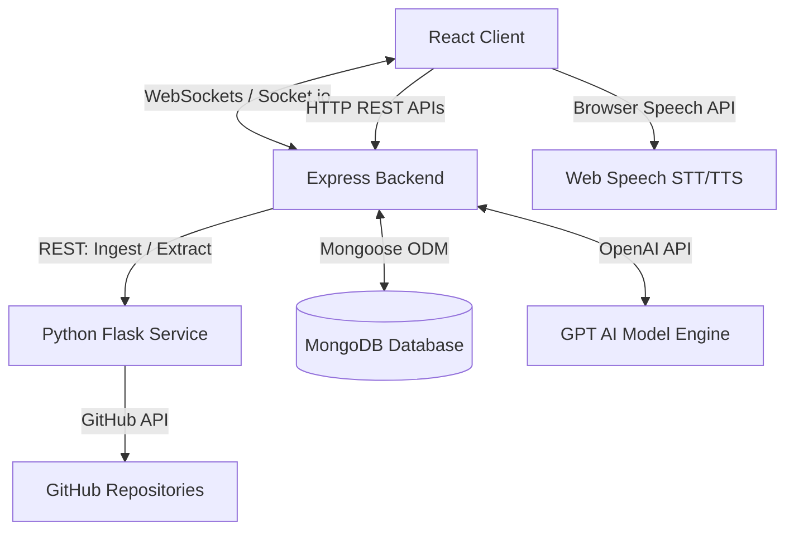
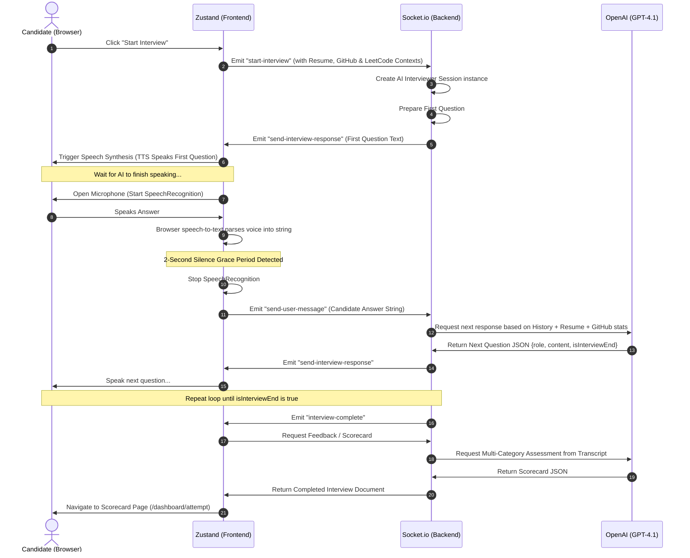

# 🎙️ AI Interviewer – Full Stack AI Mock Interview Platform

[](https://react.dev/)
[](https://nodejs.org/)
[](https://www.mongodb.com/)
[](https://www.python.org/)
[](https://www.docker.com/)
[](https://www.jenkins.io/)
[](https://www.ansible.com/)
[](https://aws.amazon.com/)

An advanced, production-ready, full-stack AI Mock Interview platform. Candidates can experience real-time, voice-interactive mock interviews customized directly to their **Resume**, **GitHub Repositories**, and **LeetCode Stats**. It uses OpenAI GPT-models for context-aware question generation and real-time conversation, accompanied by a Web Speech API-driven voice agent and an automated feedback scorecard.

---

## 🗺️ Interactive Navigation
<details open>
<summary><b>Click to toggle navigation menu</b></summary>

- [💡 The Problem It Solves](#-the-problem-it-solves)
- [🏗️ System Architecture](#️-system-architecture)
- [🛠️ Technology Stack](#️-technology-stack)
- [📂 Codebase Structure](#-codebase-structure)
- [⚡ Real-Time Voice Agent Flow](#-real-time-voice-agent-flow)
- [🚀 Local Setup & Installation](#-local-setup--installation)
- [🔄 CI/CD & Production Deployment](#-cicd--production-deployment)
- [📝 Features Showcase](#-features-showcase)
</details>

---

## 💡 The Problem It Solves

Traditional interview preparation is passive, static, and generic. Candidates study standard lists of algorithm questions or answer bullet points in their heads. 

**AI Interviewer** changes this by introducing:
* **Active Voice Simulation**: Simulates a live, conversational technical interview using real-time browser Speech-to-Text (STT) and Text-to-Speech (TTS), training candidates to speak their answers clearly under pressure.
* **Deep Context Integration**: Instead of generic questions, the platform parses the candidate's PDF resume, pulls and analyzes their actual GitHub repositories (analyzing repository files and code structures), and reads their LeetCode difficulty stats to tailor questions to their actual experience.
* **Granular Skill Assessments**: Evaluates the candidate on 5 distinct dimensions (Communication, Technical Knowledge, Problem Solving, Cultural Fit, and Confidence & Clarity) with personalized scorecards and actionable growth tips.

---

## 🏗️ System Architecture

The application is split into four primary decoupled services orchestrated via Docker:

1. **React Frontend**: Client application built with Vite and Tailwind CSS. Contains the interactive voice interview room, dashboard, leaderboard, and community feed.
2. **Node/Express Backend**: Orchestrates authentication, database operations, payment processing, community posts, and the real-time WebSocket connection to the AI interviewer.
3. **Python Flask Service**: Performs heavy-lifting utility tasks including PDF text extraction (resumes) and recursive GitHub repository structure/content digestion.
4. **MongoDB**: Primary database to persist user data, interview configurations, feedback reports, and community interactions.

### 🌐 Data & Communication Flow



---

## 🛠️ Technology Stack

<details>
<summary><b>Frontend Details</b></summary>

* **Core**: [React 19](file:///c:/Users/surya/Desktop/Projects/AiInterview/client/package.json#L21) & Vite
* **Styling**: Tailwind CSS v4 & DaisyUI v5 (glassmorphism themes)
* **Animations**: Framer Motion
* **State Management**: Zustand
* **Icons**: Lucide React
* **Charts**: Recharts
* **Voice Utilities**: Custom [speech.js](file:///c:/Users/surya/Desktop/Projects/AiInterview/client/src/lib/speech.js) managing continuous browser speech recognition (SpeechRecognition) and speech synthesis (SpeechSynthesisUtterance)
</details>

<details>
<summary><b>Backend Details</b></summary>

* **Server Framework**: [Express](file:///c:/Users/surya/Desktop/Projects/AiInterview/backend/package.json#L25)
* **Real-time Server**: Socket.io (WebSocket event gateways for bidirectional voice communication)
* **Database Driver**: Mongoose (MongoDB ODM)
* **Security & Auth**: JWT cookies, bcryptjs, Google OAuth (`google-auth-library`)
* **AI Orchestrator**: OpenAI Node SDK (`gpt-4.1-nano`)
* **Payment Gateway**: Razorpay Integration
* **File Storage**: Cloudinary SDK (profile pics, document uploads)
</details>

<details>
<summary><b>Python Microservice Details</b></summary>

* **Framework**: Flask
* **PDF Parser**: PyPDF (`PdfReader` for extracting text from resume attachments)
* **Repo Digestion**: Custom GitHub crawler scraping raw file contents and directory structures
</details>

<details>
<summary><b>DevOps & Deployment Details</b></summary>

* **Containerization**: Docker & Docker Compose
* **Orchestration / CI**: Jenkins Pipeline ([Jenkinsfile](file:///c:/Users/surya/Desktop/Projects/AiInterview/Jenkinsfile))
* **Deployment Automation**: Ansible Playbooks ([deploy.yml](file:///c:/Users/surya/Desktop/Projects/AiInterview/ansible/deploy.yml))
* **Hosting**: AWS EC2 (Ubuntu instance)
</details>

---

## 📂 Codebase Structure

Key entry points and components are linked below. Click on any file to open it directly in your editor:

### 🖥️ Frontend ([client](file:///c:/Users/surya/Desktop/Projects/AiInterview/client))
* [index.jsx](file:///c:/Users/surya/Desktop/Projects/AiInterview/client/src/route/index.jsx) - Main router defining dashboard, social leaderboard, mock interview, and settings.
* [App.jsx](file:///c:/Users/surya/Desktop/Projects/AiInterview/client/src/App.jsx) - Application wrapper checking user authentication and mounting global modals.
* [Start.jsx](file:///c:/Users/surya/Desktop/Projects/AiInterview/client/src/pages/Start.jsx) - Form enabling selection of interview topic, difficulty, question count, and toggles for Resume/GitHub/LeetCode integrations.
* [InterviewPage.jsx](file:///c:/Users/surya/Desktop/Projects/AiInterview/client/src/pages/InterviewPage.jsx) - Render target for the active mock interview page.
* [Agent.jsx](file:///c:/Users/surya/Desktop/Projects/AiInterview/client/src/components/Agent.jsx) - Interactive component visualizer hosting the AI and Candidate panels and handling recording state.
* [speech.js](file:///c:/Users/surya/Desktop/Projects/AiInterview/client/src/lib/speech.js) - Browser-level speech-to-text (STT) and text-to-speech (TTS) wrapper with customizable speech cadence and technical word pronunciations.
* [useInterviewStore.js](file:///c:/Users/surya/Desktop/Projects/AiInterview/client/src/store/useInterviewStore.js) - Client-side state manager coordinating WebSocket actions with backend.

### ⚙️ Backend ([backend](file:///c:/Users/surya/Desktop/Projects/AiInterview/backend))
* [index.js](file:///c:/Users/surya/Desktop/Projects/AiInterview/backend/index.js) - Node server startup setting up CORS, Express body-parsers, and route mappings.
* [socket.js](file:///c:/Users/surya/Desktop/Projects/AiInterview/backend/lib/socket.js) - Central Socket.io coordinator managing real-time interview event handlers (`start-interview`, `send-user-message`, and `end-interview`) and cleaning speech artifacts.
* [ai.controller.js](file:///c:/Users/surya/Desktop/Projects/AiInterview/backend/controller/ai.controller.js) - AI endpoints handling resume PDF analysis, LeetCode data retrieval, random topic creation, and comprehensive scorecard grading.

### 🐍 Python Utility Backend ([gitingest_backend](file:///c:/Users/surya/Desktop/Projects/AiInterview/gitingest_backend))
* [app.py](file:///c:/Users/surya/Desktop/Projects/AiInterview/gitingest_backend/app.py) - Flask application hosting `/extract-pdf-text` and `/ingest-repo` endpoints.

### 🐙 Orchestration & CD
* [docker-compose.yml](file:///c:/Users/surya/Desktop/Projects/AiInterview/docker-compose.yml) - Configuration mapping services to local network bridge, injecting environment values, and mounting data directories.
* [Jenkinsfile](file:///c:/Users/surya/Desktop/Projects/AiInterview/Jenkinsfile) - Multistage pipeline compiling dependencies, running lints, auditing security, checking Docker builds, and executing Ansible playbooks.
* [deploy.yml](file:///c:/Users/surya/Desktop/Projects/AiInterview/ansible/deploy.yml) - Ansible deployment playbook executing server tasks via the [app task definition](file:///c:/Users/surya/Desktop/Projects/AiInterview/ansible/roles/app/tasks/main.yml).

---

## ⚡ Real-Time Voice Agent Flow

The following lifecycle sequence takes place during a voice interview session:



---

## 🚀 Local Setup & Installation

### Prerequisites
* [Node.js](https://nodejs.org/) (v18 or higher)
* [MongoDB](https://www.mongodb.com/) running locally or a MongoDB Atlas URI
* [Python 3.11](https://www.python.org/) (with pip)
* [OpenAI API Key](https://platform.openai.com/)

---

<details>
<summary><b>Method 1: Manual Step-by-Step Setup (For Development)</b></summary>

#### 1. Setup the Python Backend
```bash
cd gitingest_backend
python -m venv venv
# On Windows:
.\venv\Scripts\activate
# On macOS/Linux:
source venv/bin/activate
pip install -r requirements.txt
python app.py
```
*Runs on `http://localhost:8000`*

#### 2. Setup the Node Backend
```bash
cd backend
npm install
```
Create a `.env` file in the `backend/` directory:
```env
PORT=5000
MONGO_URI=mongodb://localhost:27017/aiinterviewer
FRONTEND_URL=http://localhost:5173
OPENAI_API_KEY=your-openai-api-key
PYTHON_BACKEND_URL=http://localhost:8000
CLOUDINARY_CLOUD_NAME=your-cloudinary-name
CLOUDINARY_API_KEY=your-cloudinary-key
CLOUDINARY_API_SECRET=your-cloudinary-secret
RAZORPAY_KEY_ID=your-razorpay-key
RAZORPAY_KEY_SECRET=your-razorpay-secret
JWT_SECRET=your-jwt-secret
```
Start backend:
```bash
npm run dev
```
*Runs on `http://localhost:5000`*

#### 3. Setup the React Frontend
```bash
cd client
npm install
```
Create a `.env` file in the `client/` directory:
```env
VITE_API_URL=http://localhost:5000/api
VITE_SOCKET_URL=http://localhost:5000
VITE_RAZORPAY_KEY_ID=your-razorpay-key
```
Start frontend:
```bash
npm run dev
```
*Runs on `http://localhost:5173`*
</details>

<details>
<summary><b>Method 2: Multi-Container Docker Setup (For Staging/Prod)</b></summary>

Alternatively, spin up the entire application locally using Docker Compose. Ensure all `.env` files are in place in the `backend/` and `client/` directories, then run:

```bash
docker compose up -d --build
```

**Exposed Services:**
* Frontend: `http://localhost:3000`
* Express API Backend: `http://localhost:5000`
* Python Utility Service: `http://localhost:8000`
* MongoDB: `localhost:27017` (Internal only, containerized)
</details>

---

## 🔄 CI/CD & Production Deployment

The project is configured with a fully automated CI/CD pipeline triggered on git commits to the `main` branch. 

### Pipeline Sequence Map

```
[ Git Push to Main ]
        │
        ▼
┌──────────────────────────┐
│      Jenkins Agent       │
├──────────────────────────┤
│ 1. Code Checkout         │
│ 2. Schema Validation     │
│ 3. Install NPM Dep.      │
│ 4. Parallel Code Lint    │
│ 5. Security Audit Check  │
│ 6. Verify Docker Build   │
│ 7. Docker Clean Cache    │
└──────────┬───────────────┘
           │
           │ (Ansible SSH Transfer)
           ▼
┌──────────────────────────┐
│    AWS EC2 Target Host   │
├──────────────────────────┤
│ 1. Ensure directories    │
│ 2. Force Git clone       │
│ 3. Docker Compose Down   │
│ 4. Build Images & Up -d  │
│ 5. Health Check Poll     │
└──────────┬───────────────┘
           │
           ▼
[ Email Notifications Sent to developer ]
```

### Server Configuration
* **Deployment Host**: EC2 Instance running Ubuntu.
* **Credentials Manager**: Jenkins SSH Agent handles host keys via `app-ec2-ssh-key`.
* **Playbook Entrypoint**: [deploy.yml](file:///c:/Users/surya/Desktop/Projects/AiInterview/ansible/deploy.yml) invoking custom role directories to configure dependencies and spin up Docker containers.

---

## 📝 Features Showcase

* **Resume-based Contextualization**: Parses uploaded `.pdf` documents and extracts core keywords to generate customized questions.
* **Continuous STT (Speech-to-Text)**: Keeps the mic open, parsing interim responses with automatic 2-second silence detection to submit answers naturally.
* **Dynamic Filler Pronunciation**: The TTS voice engine features a translation dictionary that spells out technical jargon (e.g. speaking "API" as "A P I" instead of "ah-pee") to ensure natural voice cadence.
* **LeetCode Scraping Integration**: Reads LeetCode profile APIs to dynamically increase or decrease algorithm question complexity.
* **Razorpay Payments**: Supports flexible billing subscription tiers (Starter & Pro) to manage interview credits.
* **Community Social Space**: Share mock interview transcripts, compare leaderboard ratings, and seek advice in the integrated discussion forums.
